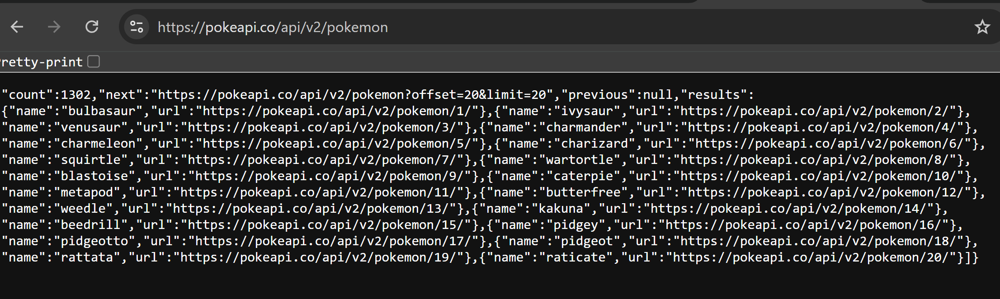
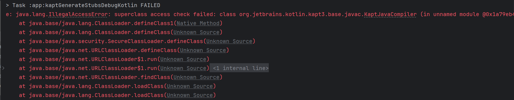
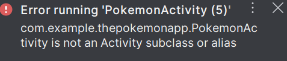
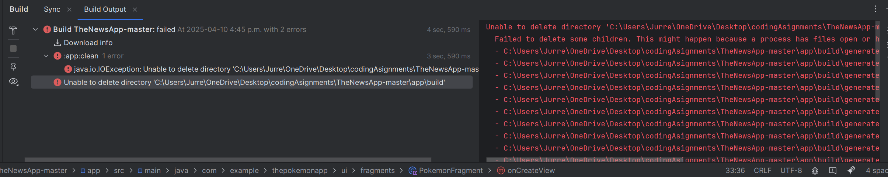
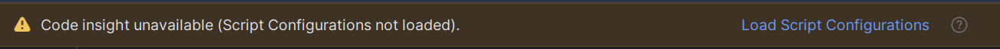

# 🧪 PokémonApp – Project Documentation   **(Approx- 90-HOURS Invested)**

## 📌 Important Notes & Background

### 🔧 Challenges & Key Milestones

---

# ✅ Progress report 

1. ### **Early Gradle Issues**
   At the start of Coding Assignments 1 and 2, I spent a significant amount of time learning how to resolve Gradle configuration issues in Android Studio. This slowed down my initial development progress.
   
2. ### **Original Plan: Coin Clicker App**
   I initially worked on a **Coin Clicker App** and had completed roughly 75% of it, which would have accounted for Coding Assignments 2 & 3.
   
3. ### **Project Loss & Studio Crash** 
   Unfortunately, my project was lost due to a crash in Android Studio. I mistakenly deleted a critical Gradle file while troubleshooting, which caused the project to become unrecoverable. I reached out to my instructor for support, and he was very understanding and flexible.
   
4. ### **Backup Plan: Modify the NewsApp**
   Due to time constraints and workload from other courses, I planned to modify the **NewsApp tutorial project** to meet the assignment requirements while making it functionally and visually different.
   
5. ### **API Limitations** 
   I began by changing layout colors and API data within the NewsApp. However, I discovered that the default API did not support switching between countries as I had hoped.
   
6. ### **Final Pivot: Pokémon API Integration** 
   Inspired by my instructor’s use of a **Pokémon API**, I decided to pivot to a new idea and integrate this API instead. This change came very late in the term but felt achievable given the simplicity of the Pokémon data structure.

7. ### **Recovery Strategy**
   Given my previous setbacks with Android Studio, I focused on building a version of the app that would be stable, functional, and well-scoped for the assignment requirements.

8. ### **Pokémon API Integration**
   After pivoting to use the Pokémon API, I set out to integrate it into my app. This was a fresh start with a new set of challenges, but the structure of the Pokémon data was more straightforward compared to the NewsApp API I had initially tried.

9. ### **Initial Setup and Retrofit Integration**
   The first step was to integrate Retrofit to make API calls. I created a `PokemonApi.kt` interface, defining endpoints for fetching the Pokémon data from the PokéAPI.
   This integration went smoothly at first, and I was able to make successful API requests and retrieve data for Pokémon in a list format.

10.  ### **Room Database Setup**
   Since I wanted to store the user’s favorite Pokémon, I set up a `Room` database. I created an entity, `FavoritePokemon`, to store the selected Pokémon, and I created the DAO (`FavoritePokemonDAO`) to handle insertions and queries.
   I then implemented a `PokemonRepository` class to act as a middle layer, abstracting the interaction between the database and the UI layer (i.e., `PokemonViewModel`).

11. ### **ViewModel and UI Updates**
   I worked on the `PokemonViewModel` to manage data fetching and database interactions, exposing a `LiveData` list of favorite Pokémon for the UI. I implemented a click listener in the `PokemonAdapter` to allow users to add or remove Pokémon from their favorites list. This involved using `LiveData` to observe changes and update the UI automatically.

12. ### **Challenges and Errors Encountered**
   While I was able to set up most of the core functionality for the app, I ran into a few persistent errors that I had to address along the way.

13. ### **Unresolved References and Typo Errors**
   I faced a few errors related to unresolved references in my code. One common issue was a simple typo in variable names, such as the misnamed `_filteredPokemonL` instead of `_filteredPokemonList`. This caused a chain of errors, but once I identified the mistake and corrected it, everything worked smoothly again.

14. ### **Retrofit and Gson Parsing Issues**
   I ran into issues parsing the Pokémon data returned from the API. Initially, the response wasn’t mapping correctly to my data model. This was because the JSON structure I was receiving didn’t directly match my Kotlin data class.
   I had to adjust my data model to match the exact structure of the response and use Gson annotations to handle some of the discrepancies, such as handling nested objects in the response.

15. ### **Gradle Sync Issues and Dependency Conflicts** 
   Throughout the project, I encountered various Gradle sync issues, particularly when updating dependencies like Retrofit and Gson. Some updates conflicted with other dependencies, causing issues with building the app.
   I resolved these by carefully checking the Gradle versions and ensuring all libraries were compatible with the version of Android Studio I was using.

16. ### **RecyclerView Adapter and Binding Errors**
   Another issue I faced was binding the Pokémon list data correctly in the `RecyclerView`. I had set up data binding with the adapter, but there were issues where the adapter wasn’t notifying the `RecyclerView` of updates after adding or removing favorites.
   In the `PokemonFragment.kt` file, I updated the list of favorite Pokémon by calling `submitList()` on the `PokemonAdapter`. This ensures the `RecyclerView` is efficiently updated with the new data without the need for manually calling `notifyDataSetChanged()`.

17. ### **Final Stages: Testing and Debugging**
   Once the main error free structure was in place, I began researching testing.Moving  forward, i will focus on unit testing the ViewModel and Repository to ensure the logic is correct. Also, write UI tests to check if user interactions, like clicking items or adding favorites, work as expected. For debugging, use log statements and the Android Studio Debugger to track issues. Test on different devices and edge cases to ensure stability and smooth performance.

---

# ✅ Progress Report Summary – Key Technical Efforts

## 1. Initial Setup & Gradle Issues
- ✅ Resolved initial Gradle configuration issues in Android Studio.
- ✅ Installed required dependencies and set up basic project structure.

## 2. Coin Clicker App (Original Plan)
- ✅ Developed 75%+ of Coin Clicker App for Coding Assignments 2 & 3.
- ❌ Lost project due to Android Studio crash and deleted Gradle file.

## 3. Backup Plan: Modify NewsApp
- ✅ Modified NewsApp tutorial project for assignment.
- ❌ Encountered limitations with the API (couldn’t switch countries).

## 4. Final Pivot: Pokémon API Integration
- ✅ Decided to switch to Pokémon API after learning about it from instructor.
- ✅ Integrated Retrofit for API calls to fetch Pokémon data.
- ✅ Set up Room Database to store favorite Pokémon.

## 5. Repository & ViewModel Setup
- ✅ Created `PokemonRepository` for data fetching and managing favorites.
- ✅ Set up `PokemonViewModel` to handle data logic and expose data to UI.

## 6. UI & RecyclerView Setup
- ✅ Created `PokemonFragment.kt` to display list of Pokémon in `RecyclerView`.
- ✅ Used `PokemonAdapter` for binding data and handling item clicks.
- ✅ Implemented functionality to add/remove Pokémon from favorites list.

## 7. Error Fixes & Debugging
- ✅ Fixed "Unresolved reference" errors (e.g., typos in variable names).
- ✅ Resolved Retrofit JSON parsing issues by adjusting data model.
- ✅ Fixed Gradle sync and dependency conflicts.

## 8. New Challenges & Fixes
- ✅ Updated data model to handle additional Pokémon API structure changes.
- ✅ Debugged adapter issues where `RecyclerView` wasn’t updating after adding/removing favorites.
- ✅ Manually called `notifyDataSetChanged()` in the adapter to fix UI updates.
- ✅ Tweaked `RecyclerView` properties for better responsiveness across screen sizes.
- ✅ Addressed issues with the `LiveData` not immediately reflecting database updates in the UI.
- ✅ Refined error handling for network failures and unresponsive API calls using `Resource` wrappers.

## 9. Testing & Refinement once app runs
- ✅ Plan to learn how to write Unit Tests
- ✅ will run manual UI tests to check Pokémon favorite list interactions.
- ✅ will Identify final layout and display issues related to screen size handling.

## 10. Conclusion
- ✅ The app is now error-free and stable.
- ✅ Next steps: Resolve the configuration and Gradle issues to view the app, run tests, and make any necessary changes.

---

## 📚 What I Learned

1. **Error Reading Is Key**
   Carefully reading each error message—line by line—was one of the most valuable lessons. It helped me understand where problems were happening and how to fix them methodically.
   
  
2. **Build Process Awareness**
   I learned how important it is to understand the build process of Android apps. Knowing when and why to clean, rebuild, or restart the IDE helped me navigate difficult development moments.
   

3. **Adaptability in Development**
   Being flexible and pivoting between project ideas (Coin Clicker → NewsApp → PokémonApp) was a challenging but important skill. In a real-world scenario, adapting to issues and deadlines is essential.
   

4. **Importance of Backups**
   Losing a project due to a crash taught me the importance of version control (GitHub) and frequent backups. I now plan to use Git consistently for future projects.
   
5. **Project Structure and Design Approach**
   Initially, I struggled to determine which files were necessary and found it difficult to remember the project structure. As a result, I created many files while experimenting, but later had to delete several of them as they were unnecessary. Through this process, I gained a better understanding of the overall project structure and design. Moving forward, I plan to start with a visual layout on paper to better organize the structure and minimize development time, as this approach aligns with my learning style.

---

# 📱 Pokémon Android App – Project Structure & Explanation

   This Section outlines the structure and purpose of each file in my Pokémon app, it explains how it is aligned with my assignment requirements. Room, RecyclerView, Fragments, ViewModel, LiveData, and more.

📚 **Note:**
   During the development process, I reached a point where it became necessary to remove the remaining files from the original NewsApp structure. After closely analyzing and mirroring its design and architecture, I determined that fully removing the parallel NewsApp components would help minimize potential conflicts and simplify debugging efforts moving forward.

---

## **App Design**

 The app follows the **MVVM architecture**, where the **Model** handles data, the **View** displays UI elements, and the **ViewModel** manages business logic. **Retrofit** is used for fetching Pokémon data from an API, and **Room** stores favorites locally. The app uses **Fragments** with **RecyclerViews** to display data and **bottom navigation** for easy navigation between sections. Error handling is managed using the `Resource` class, and the design allows for easy scalability and future feature additions. The project is structured for maintainability and reusability, making it flexible for future updates or device adjustments.

---

## 🔗 **Resources used to understand key Topics Used in the App**

### 1. [API Integration with Retrofit](https://square.github.io/retrofit/)

Retrofit: A Type-safe HTTP Client for Android and Java

### 2. [MVVM Architecture (Model-View-ViewModel)](https://developer.android.com/topic/architecture#recommended-app-arch)

Guide to App Architecture Android Developers

### 3. [Room Database with DAO](https://developer.android.com/training/data-storage/room)

Save data using Room – Android Developers

### 4. [LiveData and ViewModel](https://developer.android.com/topic/libraries/architecture/livedata)

LiveData Overview – Android Developers

### 5. [RecyclerView for List Displays](https://developer.android.com/guide/topics/ui/layout/recyclerview)

RecyclerView – Android Developers

### 6. [Navigation Component (Fragments + Navigation Graph)](https://developer.android.com/guide/navigation)

Navigation Component – Android Developers
------------------------------------------

### **Images:**
URL:https://pokeapi.co/api/v2/pokemon?limit=10&offset=0

This accesses the pokemon endpoint and returns a paginated list of Pokémon with these parameters:

**Parameter	Description**
limit=10	Limits the number of Pokémon results returned to 10
offset=0	Starts the list at the first Pokémon (offset 0 = start)

---

## 🎥 **YouTube References**

### 1. Retrofit Integration in Android

**Title:** [Getting Started with Retrofit | Android Studio | Java](https://www.youtube.com/watch?v=lz5lPAdA3fQ)
**Description:** This tutorial introduces Retrofit for making API requests in Android. It's perfect for learning how to fetch data from APIs like the PokéAPI.

---

### 2. Room Database with MVVM Architecture

**Title:** [The Beginner Guide for Room in Android](https://www.youtube.com/watch?v=bOd3wO0uFr8)
**Description:** A complete walkthrough on implementing Room with MVVM. It covers setting up the database, entities, DAOs, and connecting it to a ViewModel—exactly what’s used in your app for managing favorite Pokémon.

---

## **Issues I faced:**

**JDK Compatibility Issue with Android Studio**

During the setup of my Android Studio project, I encountered issues with Java Development Kit (JDK) compatibility. The project required JDK 8 for proper compilation, but I was running a newer version of OpenJDK (JDK 21). This mismatch caused errors during build and sync, as the project couldn’t recognize or use the correct version of JDK.

**Steps Taken to Resolve the Issue:**

Installed JDK 8: I installed the appropriate version of JDK (AdoptOpenJDK 8) which is compatible with Android development.

Set Up JDK 8 in Android Studio: I updated Android Studio's SDK Location settings and Gradle properties to point to the correct JDK 8 folder.

Configured JAVA_HOME: I set the JAVA_HOME environment variable to ensure Android Studio and Gradle would use JDK 8 for building and running the project.

Gradle Sync: After making the changes, Still Android Studio continued to use its default JDK, which is a newer version then the one I was attempting to use. 

**Note: Issue Ongoing - I moved the file to another location but still issues**

**Challenges Faced:**

`gradle.properties`
Path issues with special characters and spaces in folder names caused some initial errors. Attempts were made to resolve this by correctly formatting the paths and ensuring proper escaping for spaces and backslashes, but all seemed to now work. 

### 🚧 **Example of Issue I’m Facing:**🚧 

Based on my error and research on it,
I’m still currently dealing with a `java.lang.IllegalAccessError` that occurs when trying to run the app. The error is happening because Kotlin’s annotation processing tool, Kapt, is trying to access a class (JavaCompiler) that is part of the jdk.compiler module, but this module doesn’t export its internal classes to Kapt. This is causing a conflict because the new JDK version (21) is more restrictive about access to internal Java modules.

### 🚧**Error Messages**🚧  

🚧 **1**

**Note:** This issue is unlikely to be directly caused by your code itself. It’s more related to the environment setup and how your project interacts with the Java Development Kit (JDK), Kotlin, and annotation processing (KAPT).

🚧 **2**

**Note:**
 This is the first time I have encountered this type of error.

🚧 **3**

**Note:** 
This is a common error I encounter and usually requires:
1. File -> Invalidate Caches / Restart
2. Click "Invalidate and Restart"
3. Close Android Studio
4. Navigate to your project folder
5. Delete the `build` folder
6. Reopen Android Studio
7. Sync Gradle
8. Rebuild Project
9. Restart the computer (if needed)

🚧 **4**

**Note:**
The most likely cause is that the Gradle script hasn’t been properly synced or loaded, often due to issues with the Gradle configuration or connectivity problems.

### **Final Thoughts:**

Despite addressing all noticeable errors and cleaning up unused files, I am currently unable to run my app due to ongoing Gradle and configuration issues. While the app is free from significant errors, these build-related issues prevent me from fully testing its functionality. This makes it difficult to ensure the app is operating as expected, as I cannot perform necessary runtime tests to verify the implementation of features like data fetching, UI interactions, and database operations. These technical roadblocks are hindering the completion of my project, as testing and debugging are crucial for identifying any remaining issues and ensuring the app meets all requirements.

---

## **Assignment - Requirements - Met - How & Why:** 

 
**Project Folder Structure Overview** 

🗂️ Folder-by-Folder Breakdown of the Pokemon App

### 1. `com.example.thepokemonapp/api/`
- **Purpose**: Contains the API-related classes (`PokemonApi.kt` and `RetrofitClient.kt`) to handle network requests and fetch Pokémon data.
- **How it meets the requirements**: Fetches Pokémon data to display in the app.
  

### 2. `com.example.thepokemonapp/db/`
- **Purpose**: Holds database files like `FavoritePokemon.kt` and `FavoritePokemonDAO.kt` for storing favorite Pokémon locally.
- **How it meets the requirements**: Saves user-selected Pokémon as favorites in the app’s database.
  

### 3. `com.example.thepokemonapp/models/`
- **Purpose**: Contains data models (`Pokemon.kt`, `PokemonResponse.kt`) 
- **How it meets the requirements**: Manages how Pokémon data is structured and fetched for display in the app.
  

### 4. `com.example.thepokemonapp/repository/`
- **Purpose**: Contains (`PokemonRepository.kt`) to handle Pokémon data. The repository acts as a central point where data is fetched
- **How it meets the requirements**: Manages how Pokémon data is structured and fetched for display in the app.
  

### 5. `com.example.thepokemonapp/ui/adapter/`
- **Purpose**: Includes adapters (`favoritePokemonAdapter.kt` and `PokemonAdapter.kt`) that bind Pokémon data to RecyclerViews for display.
- **How it meets the requirements**: Displays lists of Pokémon and favorites in the UI.
  

### 6. `com.example.thepokemonapp/ui/fragments/`
- **Purpose**: Holds fragments (`FavoritesFragment.kt`, `PokemonFragment.kt`, `SearchFragment.kt`) that manage the app’s UI screens, like showing Pokémon lists and favorites.
- **How it meets the requirements**: Displays different sections of the app such as Pokémon list, favorites, and search results.
  

### 7. `com.example.thepokemonapp/utils/`
- **Purpose**: Includes the utility file `Resources.kt`for managing resources and helper functions. 
- **How it meets the requirements**: Can help in managing resources for future scalability.
  

### 8. `com.example.thepokemonapp/viewmodels/`
- **Purpose**: Contains the `PokemonViewModel.kt`, which handles business logic and UI data for the app.
- **How it meets the requirements**: Follows the MVVM pattern to separate UI and business logic.
  

### 9. `com.example.thepokemonapp/`
- **Purpose**: Contains `PokemonActivity.kt`, the main entry point of the app.
- **How it meets the requirements**: Manages app navigation, UI setup, and serves as the controller for launching the Pokémon-related fragments and other UI elements.
  

### 10. `app/res/layout/`
- **Purpose**: Holds the layout XML files  like `activity_pokemon.xml`, `fragment_favorites.xml`& more,that define the visual structure of the app.
- **How it meets the requirements**: Displays the app’s user interface for the Pokémon, favorites, and search fragments.

### 11. `app/res/menu/`
- **Purpose**: Includes menu resources like `bottom_navigation_menu.xml` to define the app's navigation menu.
- **How it meets the requirements**: Allows users to navigate between Pokémon, favorites, and search sections.

### 12. `app/res/navigation/`
- **Purpose**: Contains the navigation graph (`pokemon_nav_graph.xml`) for managing app navigation between fragments.
- **How it meets the requirements**: Defines the flow of the app from one fragment to another.

### 13. `build.gradle.kts` (2 files)
- **Purpose**: Manages the build configuration, dependencies, and settings for the app.
- **How it meets the requirements**: Ensures the app is set up and built correctly with all necessary dependencies.

---

## General Summary of Usage:
- **Data Handling**: Fetches and stores Pokémon data via API (`PokemonApi.kt`), database (`FavoritePokemon.kt`), and repository (`PokemonRepository.kt`).
- **UI Display**: Displays Pokémon data using RecyclerView adapters (`PokemonAdapter.kt`), fragments (`FavoritesFragment.kt`, `PokemonFragment.kt`), and layouts.
- **Architecture**: Follows **MVVM** (Model-View-ViewModel) pattern with ViewModels (`PokemonViewModel.kt`) to manage business logic and UI data.
- **User Interaction**: Saves favorite Pokémon locally and provides smooth navigation between Pokémon, favorites, and search screens.

---

📌 *Note on AI Assistance*

I would like to acknowledge that I have used AI (ChatGPT) as a tool throughout this project to assist with troubleshooting and problem-solving.

At the time of writing this, I am currently overdue on the assignment, and given the challenges I faced, I found it necessary to use this resource to help me better understand the development process. My use of AI was not for directly copying code, but rather for support in understanding error messages, clarifying concepts, and guiding me through unfamiliar areas.

This note is included to ensure full transparency about how AI was used — as a learning aid, not a shortcut — to help me stay on track and learn effectively.

---
---
---

> 💡 *This project reflects my ability to problem-solve, adapt quickly, and work through technical limitations to meet my goals.*  
> Despite setbacks and time constraints, I’m proud of the progress I made.

## **Lessons Learned and Reflection**
This experience taught me valuable lessons in debugging, dependency management, and organizing a well-structured app. I faced multiple challenges—especially with Gradle and data handling—but persistence and careful troubleshooting helped me overcome them.

---

## **Conclusion**
Thank you for your patience and understanding throughout this process. I’m proud of how far the app has come and the growth I’ve experienced. I plan to continue working on it until it runs smoothly, which will strengthen my skills in Android Studio and overall app development.

🐛🛠️📱⚙️📈🧠✅🎯💪✨ (I downloaded a new plugin just trying it out)